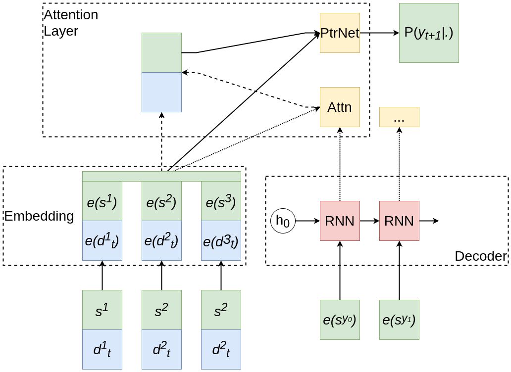
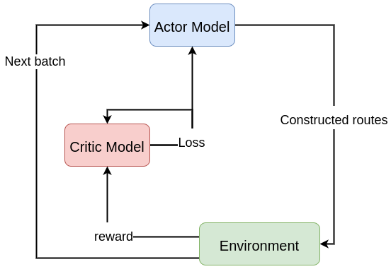
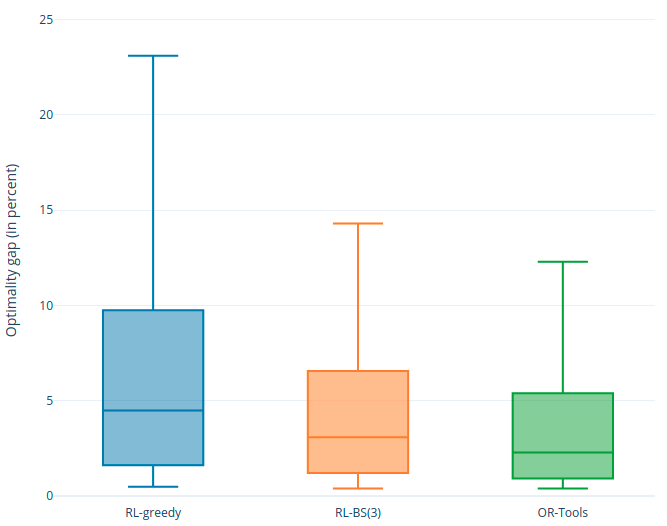
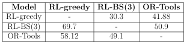
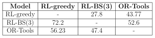
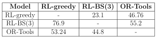
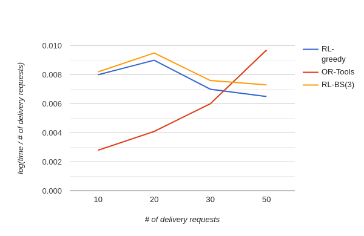

# Deep reinforcement approach to solving dynamic pickup and delivery problem

## Abstract

Pickup-and-Delivery Problems(PDPs) belong to the family of routing problems. 
The goal of a solution is to offer optimal routes for single or multiple vehicles 
to transport entities from a set of origins to another set of destinations. 
A large number of different approaches have been developed to construct routes either 
in more time-saving or less costly ways. Most of these methods are based on exact or heuristic methods. 
However, in recent researches, one may notice the growing tendency of applying deep learning(DL) 
and reinforcement learning(RL) approaches to solve the routing problems. 
Nevertheless, the PDP has a different problem formulation compared to the classical VRP and 
the feasibility of applying RL exactly to this problem is unknown. The thesis work attempts to 
fulfill this gap. The proposed approach is based on deep reinforcement learning models and 
techniques and is expected to surpass the previous approaches in both time consumption and 
optimality of constructed routes.

## Project Structure

- `or-tools` - OR-Tools model implementation.
    - `app.py` - main script to run a Flask webserver.
    - `endpoints` - contains REST API endpoint functions.
    - `services` - contains the whole logic of OR-Tools route construction.
    - `domain` - contains main data classes.
- `drl4pdp` - implementation of the proposed Deep Reinforcement Learning model.
    - `trainer.py` - contains all necessary functions to train, validate and test the proposed model.
    - `model.py` - contains all modules used to construct the proposed model in PyTorch.
    - `tasks/pdp.py` - contains the dataset class, the mask update and image render functions.

## Usage Guide

0. Install all necessary libraries:
```angular2html
pip install -r requirements.txt
```

### OR-Tools

Run the Flask webserver:
```angular2html
python app.py
```

The structure of the request JSON body can be explored in `endpoints.routing_endpoints.RoutingRequest` class.

### Proposed Model

Example of running the training process:
```angular2html
python trainer.py --task=pdp --nodes=10
```

Help for the `trainer.py`:
```angular2html
python trainer.py --help
```

## Proposed Model Architecture



*Figure 1. The proposed RL model. The inputs are transformed to embedding vectors. 
The decoder RNN model takes into account previous steps of the model. 
All vectors and the RNN output are used to construct attention vector and context. 
Finally, a Pointer Network combines the results to produce a probability distribution over the 
next step of the model.*



*Figure 2. The model training process.*

## Results



*Figure 3. Optimality gap (in percent) using 3 algorithms (RL-greedy, RL-BS(3), OR-Tools) for PDP10.*



*Table 1. Between-models comparison for PDP20.*



*Table 2. Between-models comparison for PDP30.*



*Table 3. Between-models comparison for PDP50.*



*Figure 4. Log of ratio of solution time to the number of delivery requests using 3 algorithms.*
